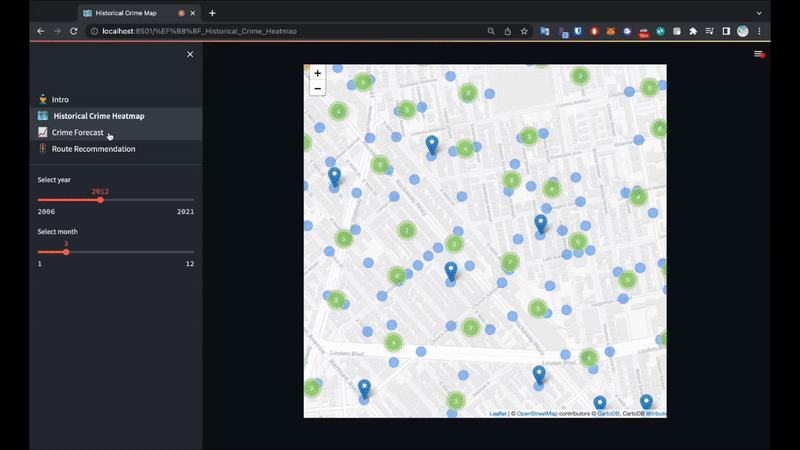

# NYC Crime Forecast

## Introduction
Historically, New York City has been one of the cities with the highest crime rate in the US. From the 1990s through the 2000s, crime rate has steadliy declined due to major efforts from the NYPD to reduce crime. However, starting from 2021, there is a surge of crime in the city again. We analyze the <a href="https://data.cityofnewyork.us/Public-Safety/NYPD-Complaint-Data-Historic/qgea-i56i" target="_blank">NYPD historic complaint data</a>, which is a dataset that includes all valid felony, misdemeanor, and violations reported to the New York City Police Department (NYPD) from 2006 to the end of 2021.

## Description
Our goal is to develop a product that could provide insights about the safety of different places in NYC. Before doing any data analysis, we had to perform data cleaning by removing missing values, locations outside of New York City and nonsensical year, age, sex and race values. We also filtered for the top 17 categories of felony and misdemeanor crimes, then built a streamlit app using the clean and filtered data.

The first page of the app is a historical crime heatmap. Users can select a year and a month and see a crime heatmap for that time frame. All incidents are grouped into clusters. Users can see the total number of incidents in each cluster and the border of the clusters.

The second page is a crime forecast app. Users can select a borough, victim demographics, a future date and get a forecasted number of crimes that could occur on that day with the selected criteria. The time series analysis is done using Facebook Prophet on the historic complaint dataset. A historic monthly and 2 years projection plot is also available for users to see the seasonality and trend of crimes over the years. 

The third page is a route recommender. Users can select a start and end point and the recommender will show a normal route, which is the shortest walking distance between the two points and a recommended route, which is the shortest distance while avoiding the crime hotspots. Each hotspot has a 0.2 miles buffer and the route planner will attempt to plot a route that goes around it.

## App Demo

## Links
- <a href="https://presthisbutton-nyc-crime-forecast-1--intro-wu44mc.streamlitapp.com/" target="_blank">Crime Forecast App</a>
- <a href="https://public.tableau.com/app/profile/florian.bogner/viz/NYPDcrimes/Dashboard1" target="_blank">Tableau Dashboard</a>

## Tools
- Python
- Pandas
- NumPy
- FbProphet
- Folium
- Openrouteservice
- Shapely
- Streamlit
- Tableau

## Dataset / Source
- <a href="https://data.cityofnewyork.us/Public-Safety/NYPD-Complaint-Data-Historic/qgea-i56i" target="_blank">NYPD Complain Data Historic</a>

